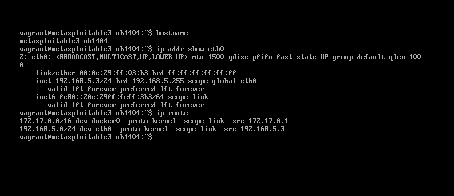
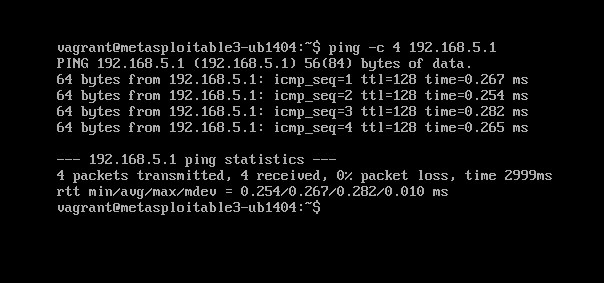
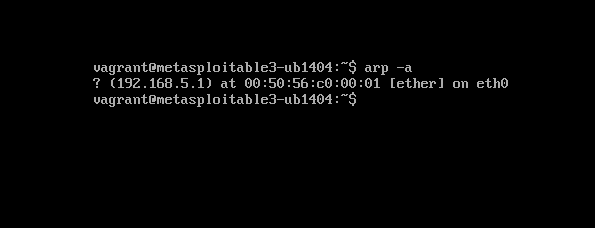

# Week 1 — Lab Environment Preparation

## Objective

Deploy and validate an isolated vulnerability assessment lab consisting of Greenbone OpenVAS, Metasploitable2, and an analyst workstation. Configure static IP addressing, verify network communication, synchronize the OpenVAS Community Feeds, and confirm that the scanner is ready to assess the target system.

> **Environment Note:** Lubuntu was used as the original analyst workstation during Week 1. It was later replaced with Ubuntu Linux at `192.168.5.10` as the lab environment evolved. The Week 1 screenshots therefore reflect the original Lubuntu workstation.

---

## Lab Environment

| System | IP Address | Purpose |
|---|---|---|
| Greenbone OpenVAS | `192.168.5.5` | Vulnerability scanner |
| Metasploitable2 | `192.168.5.3` | Intentionally vulnerable assessment target |
| Lubuntu Desktop | Historical Week 1 workstation | Lab administration and OpenVAS web access |

**Virtualization Platform:** VMware Workstation  
**Network:** VMware Host-Only  
**Lab Subnet:** `192.168.5.0/24`  
**Gateway:** `192.168.5.1`

---

## Metasploitable2

###Configuration

**Hostname:** Metasploitable2  
**Static IP:** `192.168.5.3`  
**Network Type:** VMware Host-Only

### Commands Used

```bash
ip addr show eth0
ip route
ping -c 4 192.168.5.1
arp -a
```
---

### Validation & Evidence

#### Network Configuration

The Metasploitable2 network configuration was validated using `ip addr` and `ip route`. The `eth0` interface was confirmed operational with the static IPv4 address `192.168.5.3/24`, and the system contained a route for the `192.168.5.0/24` lab network.



*Figure 1 — Metasploitable2 `eth0` interface and routing configuration confirming the assigned lab address.*

#### Network Connectivity

Connectivity to the lab gateway at `192.168.5.1` was tested using ICMP. All four packets were successfully returned with 0% packet loss, confirming communication across the VMware Host-Only network.



*Figure 2 — Successful ICMP connectivity test from Metasploitable2 to the lab gateway.*

#### ARP Validation

The ARP table was reviewed to verify local network neighbor discovery. Metasploitable2 successfully resolved `192.168.5.1` to a MAC address through the `eth0` interface, confirming Layer 2 communication with the VMware Host-Only gateway.



*Figure 3 — ARP table showing successful resolution of the lab gateway on the local network.*
