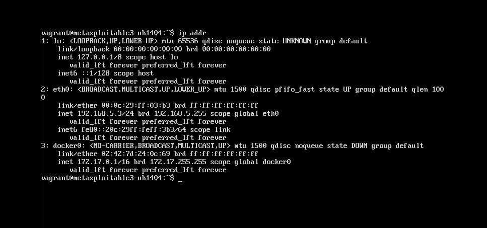
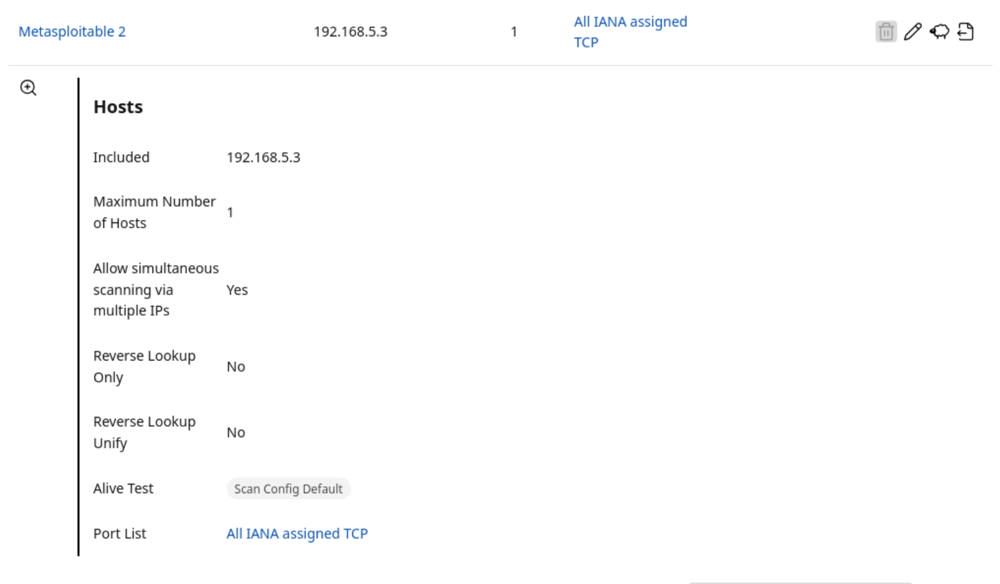
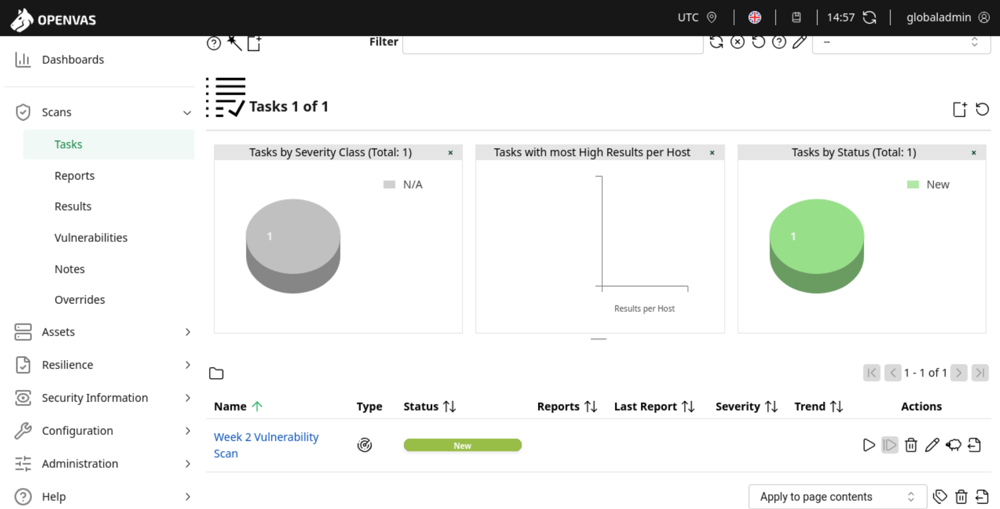
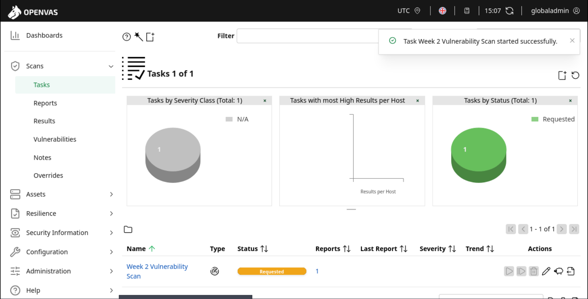
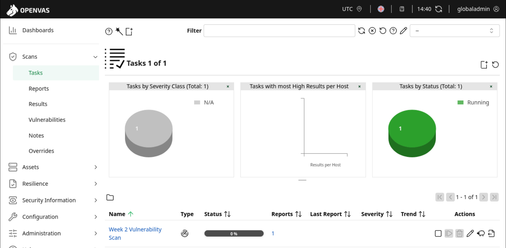
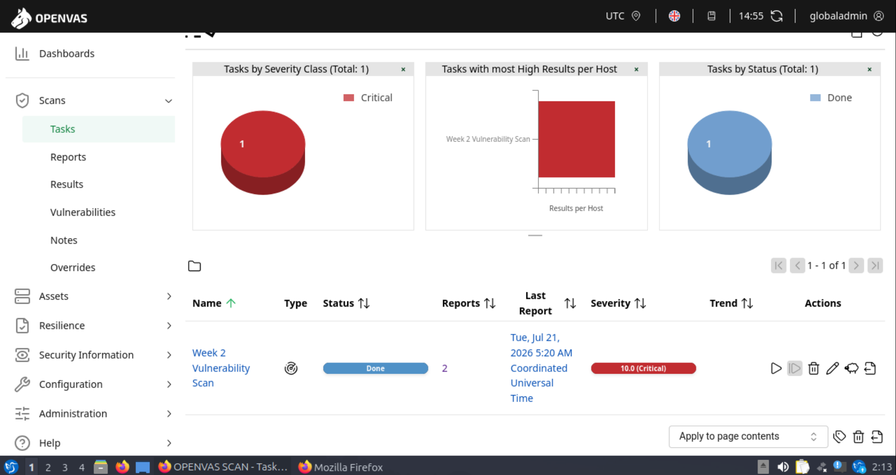
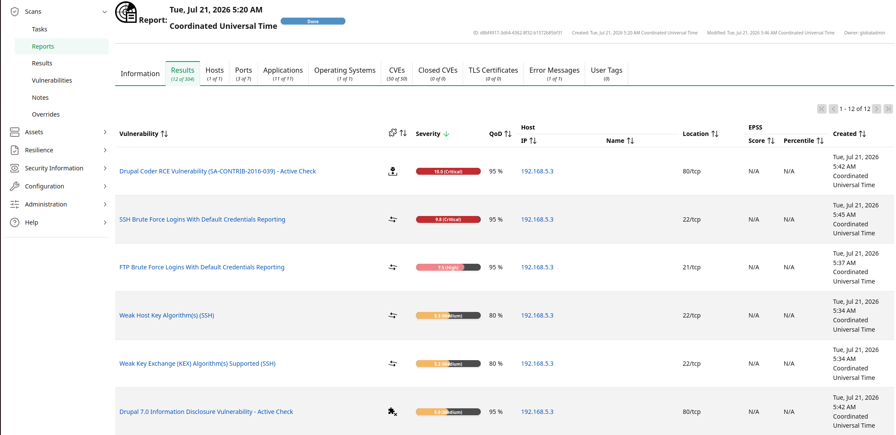
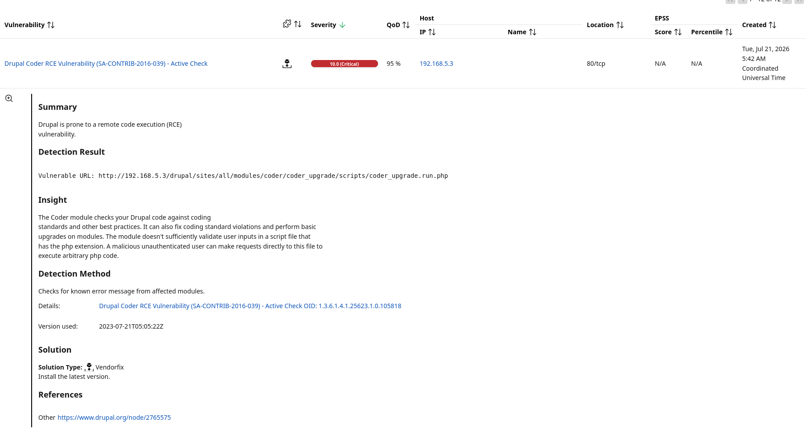
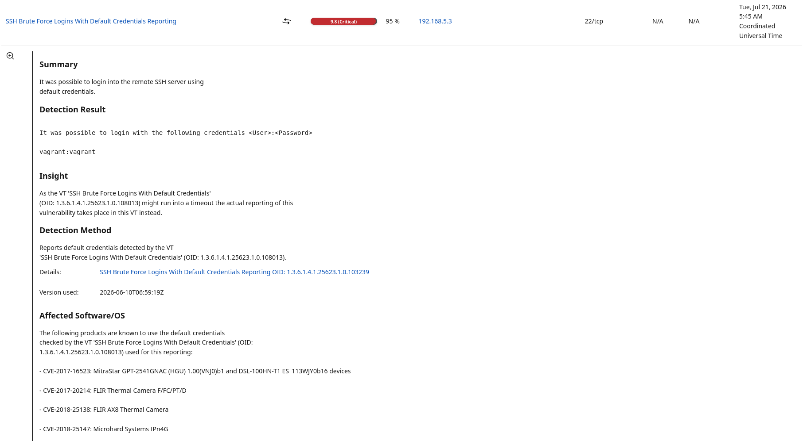

# Week 2 — Vulnerability Assessment & Risk Analysis

## Target Verification

Before beginning the vulnerability assessment, the Metasploitable2 target was verified to ensure that OpenVAS would scan the correct system.

The `eth0` interface was confirmed to be operational with the static IPv4 address `192.168.5.3/24`, placing the target on the `192.168.5.0/24` lab network.

*Figure 11 — Metasploitable2 network configuration confirming the target IP address `192.168.5.3/24` on the `eth0` interface.*

## OpenVAS Target Configuration

After verifying the Metasploitable2 IP address, a target was configured in Greenbone OpenVAS for the vulnerability assessment.

The target, named **Metasploitable 2**, was configured to scan the host at `192.168.5.3`. The target configuration used the **All IANA assigned TCP** port list to define the TCP ports included in the assessment.

*Figure 12 — OpenVAS target configuration showing Metasploitable2 at `192.168.5.3` as the host selected for vulnerability assessment.*

## Vulnerability Scan Task

After configuring the target, a vulnerability assessment task named **Week 2 Vulnerability Scan** was created in OpenVAS.

The task was associated with the previously configured Metasploitable2 target and entered the `New` state, indicating that it was configured and ready to be launched.

*Figure 13 — OpenVAS task dashboard showing the newly created Week 2 Vulnerability Scan in the `New` state.*

## Scan Execution

The vulnerability assessment was initiated from the OpenVAS task interface. OpenVAS confirmed that the **Week 2 Vulnerability Scan** started successfully and changed the task status from `New` to `Requested`.

*Figure 14 — OpenVAS confirming that the Week 2 Vulnerability Scan was successfully requested for execution.*

### Scan Progress

After the scan request was accepted, the task transitioned to the `Running` state. The OpenVAS task dashboard was monitored to verify that the vulnerability assessment had begun processing the target.

*Figure 15 — Week 2 Vulnerability Scan in the `Running` state during assessment of the Metasploitable2 target.*

## Scan Completion

The vulnerability assessment completed successfully, and the OpenVAS task transitioned to the `Done` state. The completed task reported a maximum severity score of `10.0 (Critical)`, indicating that at least one critical vulnerability had been identified on the target.

*Figure 16 — OpenVAS task dashboard showing the Week 2 Vulnerability Scan completed successfully with a maximum severity rating of `10.0 (Critical)`.*

## Vulnerability Assessment Results

The completed OpenVAS report was reviewed to identify and prioritize vulnerabilities affecting the Metasploitable2 target at `192.168.5.3`.

For detailed analysis, five findings meeting the assessment criteria were selected based on severity and Quality of Detection (QoD):

| Finding | Severity | QoD | Service |
|---|---:|---:|---|
| Drupal Coder RCE Vulnerability | 10.0 Critical | 95% | HTTP / 80 |
| SSH Default Credentials | 9.8 Critical | 95% | SSH / 22 |
| FTP Default Credentials | 7.5 High | 95% | FTP / 21 |
| Weak SSH Host Key Algorithms | 5.3 Medium | 80% | SSH / 22 |
| Weak SSH Key Exchange Algorithms | 5.3 Medium | 80% | SSH / 22 |

These findings were prioritized for further analysis because they represented significant risks including remote code execution, unauthorized authentication, and weakened cryptographic protections.

*Figure 17 — OpenVAS vulnerability assessment results for `192.168.5.3`, showing the Critical, High, and Medium findings selected for detailed analysis.*

## Detailed Vulnerability Analysis

### Finding 1 — Drupal Coder Remote Code Execution

OpenVAS identified the **Drupal Coder RCE Vulnerability (SA-CONTRIB-2016-039)** on the target's HTTP service at TCP port `80`.

- **Severity:** Critical
- **CVSS Score:** 10.0
- **QoD:** 95%
- **Affected Host:** `192.168.5.3`
- **Service:** HTTP (`80/tcp`)

The scanner identified a vulnerable Drupal Coder component capable of allowing remote code execution. The affected script did not sufficiently validate user-supplied input, potentially allowing an unauthenticated remote attacker to execute arbitrary PHP code.

OpenVAS identified the vulnerable resource within the Drupal Coder module:

`/drupal/sites/all/modules/coder/coder_upgrade/scripts/coder_upgrade.run.php`

Successful exploitation of a remote code execution vulnerability could allow an attacker to execute commands or code on the affected system, potentially resulting in system compromise.

**Recommended Remediation:** Upgrade the affected Drupal Coder component to the latest supported version and remove or disable vulnerable components that are no longer required.

*Figure 18 — OpenVAS analysis of the Critical Drupal Coder remote code execution vulnerability detected on `192.168.5.3:80`.*

### Finding 2 — SSH Default Credentials

OpenVAS identified a Critical authentication weakness on the SSH service at TCP port `22`.

- **Severity:** Critical
- **CVSS Score:** 9.8
- **QoD:** 95%
- **Affected Host:** `192.168.5.3`
- **Service:** SSH (`22/tcp`)

The assessment determined that the SSH service accepted default credentials. OpenVAS successfully authenticated using the default credential pair `vagrant:vagrant`, demonstrating that the weakness was exploitable rather than merely inferred from software identification.

Default credentials create a significant security risk because an attacker who discovers an exposed SSH service may be able to authenticate without first exploiting a software vulnerability. Successful access could expose sensitive information, permit unauthorized system changes, or provide an initial foothold for further compromise.

*Figure 19 — OpenVAS reporting successful authentication to the SSH service on `192.168.5.3:22` using default credentials.*

## Detailed Vulnerability Analysis

### FTP Default Credentials

OpenVAS identified that the FTP service on `192.168.5.3:21` accepted the default credentials `vagrant:vagrant`. The finding was rated **High (7.5)** with a **95% QoD**, providing strong confidence that the weakness was successfully validated.

The use of default credentials could allow an unauthorized user to authenticate remotely to the FTP service and potentially access sensitive files or modify system content.

**Remediation:** Remove all default credentials, enforce unique strong passwords, and disable FTP if the service is not required. Where file-transfer functionality is necessary, a secure alternative such as SFTP should be considered.

*Figure XX — OpenVAS identifying successful FTP authentication using default credentials on the Metasploitable2 target.*

---

### Weak SSH Host Key Algorithm

OpenVAS identified that the SSH service on `192.168.5.3:22` supported the deprecated `ssh-dss` host key algorithm. The finding was rated **Medium (5.3)** with an **80% QoD**.

The use of outdated host key algorithms weakens the cryptographic security of SSH communications and may expose connections to attacks against deprecated cryptographic standards.

**Remediation:** Disable `ssh-dss` and other deprecated host key algorithms and configure the SSH service to use modern, strongly supported cryptographic algorithms.

*Figure XX — OpenVAS identifying the deprecated `ssh-dss` host key algorithm supported by the SSH service.*

---

### Weak SSH Key Exchange Algorithms

OpenVAS identified weak key exchange algorithms supported by the SSH service on `192.168.5.3:22`. The finding was rated **Medium (5.3)** with an **80% QoD**.

The detected algorithms included:

- `diffie-hellman-group-exchange-sha1`
- `diffie-hellman-group1-sha1`

These algorithms rely on deprecated SHA-1 hashing and, in the case of Group 1, a 1024-bit MODP group. Continued support for these algorithms weakens the cryptographic protection of SSH connections.

**Remediation:** Disable the deprecated SHA-1-based Diffie-Hellman key exchange algorithms and configure SSH to use modern alternatives such as Curve25519 or other currently recommended key exchange methods.

*Figure XX — OpenVAS identifying deprecated SHA-1-based Diffie-Hellman key exchange algorithms supported by the SSH service.*
